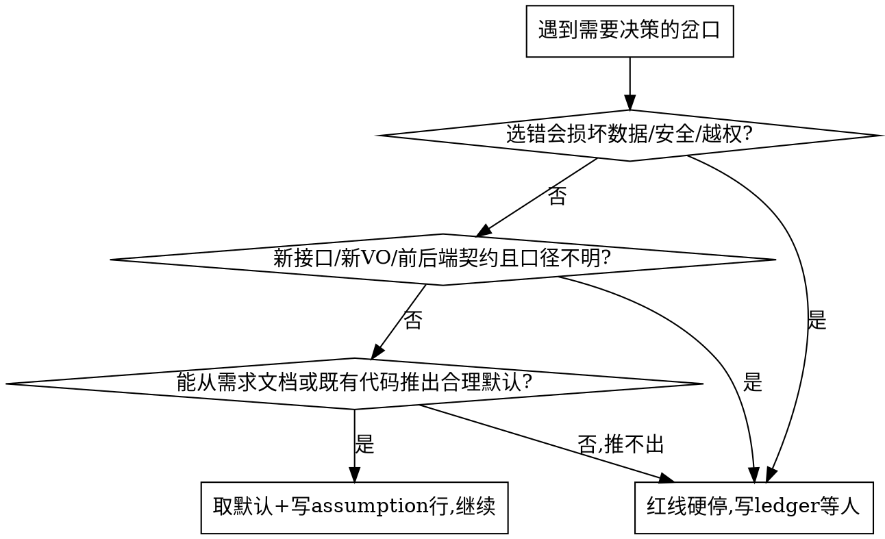

# auto-sdd —— 自驱 SDD 交付(喂需求文档,跑到达标)

## Overview

给定**完整需求文档 + 机器可判定的验收条件**,按工业界 **inner/outer loop** 自驱跑完两段:
- **inner loop(STEP1-2,本地无人值守)**:设计→**设计收口门(覆盖矩阵 + 独立对抗)**→编码→本地自测(修到全绿)→按当前分支 diff gate 收口（主会话自审必做，独立 review 可跳过）。
- **提测+部署(STEP3,自驱)**:收口后产提测包 → **提测与部署按项目约定（若已安装对应 skill）**:有提测/流水线 skill 时按其自驱触发,没有时跑项目脚本化部署 → 轮询部署回执 → 成功进 e2e。部署自驱进行;打磨期的人工检查由 §人工审核闸 收口闸在提测前提供。
- **outer loop(STEP4,部署后 resume)**:针对**已部署测试环境**跑 e2e → e2e bug 经熔断 + 分类闸,只有真代码缺陷打回 STEP1。

> **术语(两套别混)**:`STEP1-4` 是**粗粒度阶段**标号——STEP1-2=本地 inner loop / STEP3=自驱提测+部署 / STEP4=部署后 e2e(outer loop)。下文「流程」的 **1-9 是细分步骤**,一律**按内容名引用**(如"逐 goal 编码""收口""gate-design"),不叫 STEPn。

核心行为转变:平时该问用户的多选决策,在本 skill 下转成"取最合理默认 + 记假设行",**不逐步打断**;只有真正不可继续的才红线停(**例外:`human-review gate` ON 时额外在设计/收口两点停,见 §人工审核闸**)。全程把进度/假设/段间衔接落 `06-ledger.jsonl`(靠它 resume 跨过部署等待与压缩)。

> 本 skill 显式覆盖 `refs/multi-choice-decision.md` 与需求探索类 skill(若已安装)的逐步问询门——**仅在需求文档完整、验收可判定时成立**。需求模糊就不该用它。

## 项目适配点(全局 skill;按项目替换)

本 skill 方法论通用,下列绑定按项目替换;以项目 `CLAUDE.md` / `AGENTS.md` 与项目档案的声明为准:

| 适配点 | 示例默认(Java / Spring Boot) | 说明 |
|--------|---------------------|------|
| 构建 / 测试 | `mvn test/compile -pl <module> -am` | 非 Java 项目换成对应命令(`npm test` / `pytest` 等),以项目声明的本地自测入口为准 |
| DB 执行 | 项目约定的数据库执行工具 | 用于 DDL / 数据脚本执行到开发与测试环境、gate-design 活体核验取样;项目未提供时先问一次并写回项目声明 |
| e2e 框架 / 落点 | 项目声明的 e2e 资产宿主(如 Playwright 独立工程,锁版本+README 装依赖/登录取态) | 唯一落点,写在项目「测试基础设施映射」;覆盖主要+次要流程(供后续回归) |
| **提测+部署 / outer-loop e2e**(STEP3-4) | 提测与部署按项目约定（若已安装对应 skill） | 无提测/流水线平台时,STEP3「自驱提测」退化为**自驱产部署包 + 跑项目部署文档中的脚本化部署 + 验证回执**;STEP4 e2e 落点不随部署档分流 |

## 运行前硬条件(缺一不可,否则先补再跑)

1. **需求文档**路径明确、内容完整(目标、范围、字段/契约、边界都在)。
2. **验收条件机器可判定**:能写成命令/断言,例如
   `mvn test -pl <module> -am 全绿` + 列出验收用例 ID + 关键落库断言。
   判不了"达标"=停不下来——先把它定成可判定的,再开跑。**本地段**验收=`构建测试全绿 + 落库断言`;**e2e 段**验收=项目声明的 e2e 资产宿主内套件报告全绿(API + UI 主要+次要流程)。
   - **可判定性前置筛(EARS 句式)**:每个行为单元强制改写成 `WHEN/IF/WHILE <可观测条件> THE SYSTEM SHALL <可观测输出>`。写得出 SHALL 句=可机器判定(进 unit/contract/integration/e2e);**写不出=当场判 `manual` 并记原因**,别勉强配假断言(false-confidence 温床)。把"模糊需求"在拆解阶段就分流掉,避免循环空转在一条本就不可断言的需求上。
3. **非交互权限姿势**:本 skill 是行为指令,**压不住 harness 权限弹窗**。必须在 auto-accept / bypass 模式或 `claude -p` headless 下跑,否则照样逐步弹确认。
4. **基线分支启动时给定**:`rules/worktree-management.md` 要求建 worktree + 选基线,而选基线本是交互门。本 skill 下基线**由调用方启动参数给定**(如 `基线=develop`);缺省则取项目声明的基线分支并写假设行,**不交互问**。建 worktree 走 `rules/worktree-management.md`,worktree 分支**严禁 push origin**。
5. **e2e 段(STEP4)前置**:仅在提测+部署完成、**测试环境已部署成功**后 resume 触发;验收条件此时**扩为含 e2e 报告全绿**(项目声明的 e2e 资产宿主内套件,API + UI 主要+次要流程)。部署未确认就不进 STEP4(写 ledger 等部署回执)。
6. **技术栈已定**(新项目/新独立服务前置):auto-sdd **假设栈已定、不做选型**——SA 设计直接拿栈用。新项目若栈未定,**先做技术选型**(若已安装技术选型类 skill 用它;按需求场景+工程阶段对比 语言/部署/存储/中间件/前端,出推荐+ADR,判据见 `refs/engineering-tradeoff.md`),把 ADR 的 Decision 作为本 skill `02-design`(或域级 `00-roadmap` 锁定决策)的栈输入。**禁止惯性"复用上一个项目模板"当默认**。栈由继承现有项目 / 用户已指定时,跳过本条直接进。
   - **greenfield 项目额外(栈定后、进 STEP1 前)**:先在**空项目(0 存量基线)**上立架构骨架 + 机器门禁(ArchUnit/Checkstyle/PMD/SpotBugs)+ CI 真跑 verify(不 skip)+ CLAUDE.md §结构硬约束(若已安装项目骨架类 skill 用它),让后续每个 goal 在门禁下写。**跳过=攒够文件再回炉重构(反模式)**。已有代码库(骨架/门禁已在)跳过本条。

## 范围分级:单模块直跑 / 域级先铺 batch roadmap

下面「流程」是**一个 inner-loop 单元**——单模块 / 单功能直接跑一遍即可。**范围 > 单模块(域级:跨多模块、多 batch、数周+)时,先铺 batch roadmap,再逐 batch 跑**;别把数月的域塞进一个 inner loop(单轮 300 行护栏会逼你临时乱拆、无连贯计划)。

**域级起手——进 STEP1 前先产 `00-roadmap.md`**,至少含:
1. **锁定决策**:架构基准 / 基线分支 / 首批范围 / **代码结构(顶层按业务域分包,见 `refs/design-doc-principles.md §五`)** 等**跨批前置决策**,开工前交用户拍板(域级决策错 = 代价 × 批数)。
2. **有序 batch 序列**:每 batch 标 **Depends(依赖哪些 batch)+ 文件边界 + 满足的需求块/AC**;goal 编号全域贯通(G1..Gn),batch 内再排执行序(地基 goal 先行)。
3. **跨批贯穿红线 / 纪律**:域级硬约束(同步边界、算法红线等)一次列清,每 batch 都受约束。
4. **资源映射**:构建 / 测试 / DB / e2e 落点(项目适配点)。

**然后逐 batch 跑**:每 batch = 一遍完整 inner loop(设计→gate-design→逐 goal 编码→收口)+ 自驱提测+部署(按项目约定)+ 部署后 e2e;`06-ledger.jsonl` **跨 batch 承载进度**,resume-first 按 batch 续。`00-roadmap` 与各 batch `02-design` 冲突 → **以 02-design 为准**(roadmap 导航、design 是契约)。

## 流程

1. 读需求文档 + 验收条件;开 `.claude/tasks/<id>/`,建空 `06-ledger.jsonl`(模板见项目侧 `.claude/tasks/_templates/06-ledger.template.jsonl`)。**域级范围先按 §范围分级 产 `00-roadmap.md` 拆 batch,再逐 batch 进本流程。**
2. **SA 设计**:产 `02-design.md`(契约/DDL/状态机/测试归属表,按 `refs/design-doc-principles.md`),拆成有序 goal `G1…Gn`,**每 goal 标注 Depends(依赖哪些 goal)、文件边界(预计改动的模块/文件域)、满足的验收条件 ID(`G2 满足 AC-3,AC-4`,正向溯源用)**——后续 diff 审查发现越界改动即红旗(scope creep 或拆分错了)。
   - **测试归属表必含对抗用例**:每个行为单元除正向外,**点名列出反向(校验拒绝/权限拒绝/状态非法)、边界(空/超长/越界值/null)、并发(同 key 抢占/幂等/分布式锁)**——涉及扣减/抢占/计数的 goal **必须**有并发用例。这些是本地层对抗,不留给 e2e。对抗用例进对应 unit/contract/integration goal,与正向一起跑绿才算 complete。
3. **设计收口门(gate-design,进编码前必过 —— 不过门不编码)**:02-design 完成后**不直接编码**,先过设计门,关掉"对抗只在测试侧、设计侧裸奔"和"需求正向覆盖无产物"两个缺口——
   - **覆盖矩阵(正向溯源 / 满足需求)**:逐条把需求文档的验收条件映射到 goal,在 `02-design` 内产 `验收条件 → goal → 计划测试层` 对照表;**有验收条件落不到任何 goal = 漏需求**,补 goal 再过门(每个 goal 反标满足的 AC-ID,与步骤 2 对齐)。
   - **对抗审查(独立视角,非自审)**:派**独立 reviewer subagent**(不继承本 session 设计上下文)按 `refs/design-doc-principles.md §二` 审 02-design —— Round1 完整性(对照矩阵无空格)/ Round2 一致性(字段名·状态码·表名拼写,§三点五)/ Round3 对抗性(三视角 + 列"陌生 reviewer 的 3 个具体问题"再答;**多系统项目再加一视角:跨系统集成姿势 / 数据归属边界——本系统是否把外部系统的表当自己的 CRUD?跨系统读写是否单点经同步边界?**)。**同 context 自审会退化**(`refs/design-doc-principles.md §二点一`),对抗轮必须换独立 context 才算数。
   - **验收条件 / grader 同样对抗(别只审设计)**:reviewer 顺手把每条**验收条件本身**也对抗掉——**自洽**(无相互矛盾)/ **可判定**(grader 不死板误判合法格式)/ **真对应需求意图**(没把需求写歪或漏)。坏的验收条件**在编码前拦下**,不拖到 e2e 才靠"0% 通过疑 grader"晚捕(分类闸第 5 路)——那时整个 inner loop 已白跑。这是上游唯一对验收条件做语义对抗的点,EARS 只筛了形式。
   - **活体核验(契约断言跑库/追源证伪,非文档自洽)**:设计里每条**数据契约断言**——SQL 谓词 / 字段名 / 字段类型 / 枚举值 / 状态码 / 表名 / 跨表 JOIN 基数——过门前必须用数据库执行工具跑真实库 + grep 追源**活体证伪**,不能停在文档层"拼写一致 / 覆盖无空格"。最低三动作:① 每个**查询谓词**跑一次取样,确认命中集**含/不含软删 `del_flag`**、边界、null 与设计意图一致(实证:业务谓词漏软删条件 → 大量软删行被拉进,gate 标 no-gap 仍漏过);② 每个**字段类型 / 枚举 / 状态码**追到 entity 注解 + DDL + 字典源核对真实值(防 Integer↔String 错配、注释滞后);③ 跨表取值(`findFirst`/聚合)用真实多行样本验顺序。依据 `rules/context-engineering.md §三段式 + §3.5` 与 `refs/design-doc-principles.md §三点五`,本节把它**升为 gate-design 编码前硬门**(过门必跑,非事后自省;**对象 = 设计文档里的契约断言,≠ 逐 goal 编码后对实现代码的真实数据自测**)。**未活体核验的契约断言 → 覆盖矩阵的 no-gap 不成立**,补跑再过门。
   - **过门处置**:reviewer 提的问题**可修则回填 02-design / 改验收 spec 再编码**;**验收条件自相矛盾或不可判定、契约 / 前后端口径不明** → 不在门内默认,走红线停(§红线,对齐"需求文档自相矛盾,或验收条件无法判定")。全部闭环后过门 append ledger `{"goal":"设计","status":"complete","gate":{"stage":"gate-design","coverage":"no-gap","adversarial":"independent-reviewer","liveCheck":"verified","last_good_commit":"<sha>"},"evidence":"覆盖矩阵无空格 + 独立对抗 N 问闭环 + 契约断言活体核验(谓词取样/类型追源)"}`(`last_good_commit` 必带,熔断回滚锚点,见 §自适应熔断)(goal 固定字面量 `"设计"`,同 `"收口"` 供机器精确匹配)。**若 `human-review gate` ON(§人工审核闸):此处改标 `blocked:human-review` + STOP 交人工审设计,过审才进逐 goal 编码。**
4. **逐 goal 自驱**(走 `rules/executor-handoff.md`;**编码 goal 默认串行,可并行性 / 子代理派发见 §任务编排**):编码 → 实现者自审与测试 → append goal 结果；同一 worktree batch 的全部 goal 收口后，以该 batch 待合入基线的最终 change-set 做一次主会话 diff 自审，并按实际 diff 做审查判档决定是否另派 reviewer(若已安装 `code-review` skill 按其门控) → 构建(如 `mvn compile -pl <module> -am`)→ 真实数据自测 → **append ledger**。findings 一次性返工，修复后默认做定向增量复审；失败即修重跑,`failed→…→complete` 留痕。范围只能是当前仓库+当前 worktree 分支，不按 PR、不跨兄弟仓库，也不为每个 goal 重复启动 review。
   - **含 DDL / 数据脚本的 goal**:生成后用项目约定的数据库执行工具(见「项目适配点」)**执行到开发与测试环境**(生产除外)再标 complete,不能只生成文件。
   - **经验前传**:goal 过程中发现对后续 goal 有用的事实(字段口径 / 工具姿势 / 隐藏前置 / 踩坑),append `{"goal":"Gx","status":"note","evidence":"<供后续 goal 复用>"}`;**每个新 goal 起手先扫 ledger 的 note 行**——逐 goal 新上下文会重复踩同坑,账本是唯一前传通道。
5. **收敛判定**:跑验收条件(构建测试 + 验收用例)。未达标 → **按根因纪律定位**(先稳定复现 → 找根因 → 再改;禁症状式修补、禁猜)→ 修 → 重判,循环直到达标。修复后**必跑相邻影响**(`refs/design-doc-principles.md §二点一`:列出受影响的相邻元素/下游消费方逐一验证),不只验失败那一条。
6. **收口(inner loop 末)—— gate-local 三项硬门,缺一不过**:① 本地自测全绿(若已安装 `local-verify` skill 按其执行)+ 主会话 diff 自审通过 + 当前分支审查判档满足（`skip` 即无需独立 reviewer，`single/dual-candidate` 须完成对应 scoped review；本地不使用 PR）;② **实建测试层 == 02-design 归属表声明层**——`grep` 实际注解核对(`@WebMvcTest`=contract / `@SpringBootTest`=integration / 纯 Mockito=unit,`refs/test-suite-hygiene.md §八.6`):**声明了 contract 却 0 个 `@WebMvcTest` = 归属画饼**(实证:设计标多条 AC=contract 却全仓 0 `@WebMvcTest`,ledger 未记坍缩);层坍缩(如 contract→integration)**允许但必须 ledger 记原因**,不许静默;③ **`last_good_commit` 已记**(本次绿色 commit sha,熔断回滚锚点,见 §自适应熔断)。三项过后写 ledger 收口行(goal 固定为字面量 `"收口"`,`gate.stage="gate-local"`,**含 `last_good_commit` 字段**)。**若 `human-review gate` ON(§人工审核闸):收口行先标 `blocked:human-review` + STOP 交人工审,过审才进自驱提测+部署(产提测包)。**
7. **提测+部署(自驱)**:产**提测包**(变更清单 + 验收结果 + diff)。**部署路径按「项目适配点」表「提测+部署」档分流**:提测与部署按项目约定（若已安装对应 skill）——有提测/流水线 skill 时按其自驱创建提测、触发构建与部署并轮询回执,模块→流水线映射以项目声明为准,对所有 affected repo 求并集;**无平台时自驱跑项目部署文档中的脚本化部署 + 验证回执**(部署本身仍自驱、非手工 STOP;唯生产发布操作受 §红线 约束)。**部署完整性**:回读流水线实际 source commit,必须等于本批冻结的 `deploy_commit`,确认前后端是同一批版本。ledger 记 `{"goal":"handoff","status":"await:deploy","evidence":"已提测+触发部署,轮询回执;成功 resume e2e"}`——**自驱等部署、非手工 STOP**;失败按部署/流水线层分类(凭据 / 任务完整性 / 节点被跳过)处理,不当代码 bug。打磨期人工检查点由 §人工审核闸 收口闸提供(在本步之前)。

8. **(部署成功后)STEP4 e2e**:部署回执成功(resume-first 读 ledger 命中 `await:deploy`)→ 进 e2e。读 `02-design.md` 测试归属表的 **e2e 行** → **统一从项目声明的 e2e 资产宿主跑/沉淀** → **API e2e 自驱 + UI e2e 覆盖主要+次要流程**(主流程+次要/异常分支,非黄金路径简化版);**manual 行只列清单**交提测 checklist → 产测试报告(用例 + 结果)。提测**清单/范围**若已由提测类 skill 产出,e2e 段不重复生成(决策①)。
   - **e2e 回归沉淀(验证未收口的唯一标准,对齐 `sdd-pipeline`)**:e2e 脚本**探索一次即固化**为可执行 spec(非 md 描述),**唯一落点 = 项目声明的 e2e 资产宿主**;**覆盖主要+次要流程**(主流程+次要/异常分支,非黄金路径简化版——资产供后续回归用);**登记项目资产索引并给 entrypoint 一行命令**;检索先查索引(`refs/test-suite-hygiene.md §四点一/四点二`)。**用例跑过但没登记=验证未收口**。
   - **需求一致性回链**:e2e 报告必须回链 `02-design` 覆盖矩阵的验收条件 ID,证明"部署后行为 = 冻结需求";有验收条件无对应 e2e/测试 = 漏覆盖,回补再判达标。
9. **e2e bug 判定(outer loop)**:报告有 fail → 走 **e2e bug 分类闸**(加载 `rules/e2e-bug-triage.md`)→ 按五路处理 → `targeted 回归`(只跑受影响 e2e + smoke,非全量)→ 重判,直到 e2e 报告全绿 → 写最终 gate 行(模板 `final-e2e` 样式),本次发布达标。

## e2e bug 分类闸(指针)

不是所有 fail 都回 STEP1。**e2e 报告出 fail 时加载 `rules/e2e-bug-triage.md`**——含五路分类路由(真代码缺陷/测试脆性/环境 flake/契约漂移/验收条件坏)、测试脆性四桶修法、🔴改测试红线(防 reward hacking:只准动 selector/wait/fixture/数据准备,绝不准动 expected 断言值)。**e2e 脚本探索一次即固化,复测直接复用,不重复探索**(决策③)。

## 自驱纪律(仅红线停 + 全程账本)

- **不逐步确认**:would-be 多选决策 → 取最合理默认 + 写假设行
  `{"goal":"Gx","status":"assumption","evidence":"按<默认>处理,理由<X>,影响<Y>"}`,继续干。
- **不静默降级**:`passed` 必须真跑达标(`refs/test-suite-hygiene.md §九`);禁对本批正在验证的行为直接改 DB 状态字段凑过(边界见 `refs/test-suite-hygiene.md §九第 4 条`)。
- **执行体声明独立核实**(`rules/executor-handoff.md §执行体汇报必独立核实`):不信 summary,关键声明自己跑一遍。

## 任务编排:子代理(subagent)协作(指针)

auto-sdd 不必单 agent 串到底,但**编排得守纪律**。**要 fan-out 子代理、派工、核实产出时加载 `rules/orchestration.md`**——含四执行体 lane 划分(人/主 agent/subagent/外部执行体)与 6 条编排纪律(克制阀 / 前台同步并发优先 / 该与不该 fan-out 清单 / prompt 自包含 / 产出独立核实分级)。编码主路默认串行,只读调查类才并行。

## 遇到岔口:默认还是停?(核心判断,别赌)

## 红线硬停(只有这些才停;停了写一行 ledger + 一段说明,等人)

- 安全/敏感信息(密钥、生产数据、越权)
- **新接口 / 新 VO 前后端口径不明**——契约冻结前不硬编字段名(`refs/design-doc-principles.md §三点六`)
  - 边界(**刻意不收紧**):**响应侧 VO 字段命名口径不明 = 停**;**请求侧简单入参**(语义明显、可从既有代码推出)可**默认 + 记 assumption** 继续,信任判断 + 账本事后审。需更稳时才把请求侧也一律停。
- **自适应熔断命中**(见下"自适应熔断"段)→ 转人工,写 halt 报告
- 需求文档自相矛盾,或验收条件无法判定
- 任何生产 DB / 生产发布操作

## 人工审核闸(human-review gate,可选模式)

auto-sdd 稳态 = "仅红线停 + 不逐步确认";但 skill **未成熟打磨期 / live 高风险数据(错误不可逆)/ 用户显式要求** 时开此模式,在两个固定点插人工闸。**它不是红线**(红线=事件驱动 blocker、随时触发),是**模式级的 2 个计划停点**,与红线、提测+部署(STEP3 自驱)正交;是**主动 STOP + 交人工**(写 ledger + 交摘要),不是 harness 权限弹窗。

**开/关(调用方启动时声明;缺省按下表)**:

| 触发 | 模式 |
|---|---|
| skill 打磨期 / 自驱链路未充分验证可信 | ON |
| live 生产 / 业务数据、错误不可逆(高风险) | ON |
| 成熟稳定 + 用户显式解除 / 用户说"全自驱·不要停" | OFF |

缺省:**打磨期 / 高风险 live-data 项目默认 ON**(当前决策正确率最痛,见 `refs/engineering-tradeoff.md`);成熟后由用户**显式**关,不自行假定可关。

**两道闸(ON 时)**:
1. **设计闸**(每 batch,gate-design 闭环后、进逐 goal 编码前):ledger 标 `{"goal":"设计","status":"blocked:human-review"}` + STOP,交用户**设计摘要 + 覆盖矩阵 + 风险/假设行**;拍板才进编码。
2. **收口闸**(本地收口后、进自驱提测+部署前):ledger 标 `{"goal":"收口","status":"blocked:human-review"}` + STOP,交用户**全量 diff + 本地验收结果 + assumption 行**;OK 才产提测包触发提测。

**resume**:用户反馈即处置——通过→改该 ledger 行推进;打回→按反馈回 gate-design 改设计 / 回逐 goal 改码,再过本闸(不绕)。

**与其它停点区分(别混)**:红线硬停 = 随时的事件 blocker;提测+部署(STEP3)= **自驱**(非停点);人工审核闸 = **可开关**的 2 固定点。**OFF 时只剩红线会停 = skill 稳态默认行为(提测自驱、不逐 batch 停)。**

## 护栏与自适应熔断(指针)

**判 budget 超标、是否熔断、回滚时加载 `rules/circuit-breaker.md`**——含单 goal 预算两档(降级子代理 ≤300行/8文件;外部执行体 ≤1域/25文件,超标必拆或必记账)、自适应熔断三层信号(token 预算为主 / 进度信号主力 / per-goal 计数兜底)、熔断动作(先回滚 last-good checkpoint 再转人工)。**`last_good_commit` 是熔断回滚唯一锚点,gate-design / gate-local / 每个 `complete` 行必带(sha),不是可选 prose。**

## 收口交付(两次,均一次性审而非逐步)

- **inner loop 收口(STEP2 后)**:① ledger(含 assumption 行)② 当前 worktree batch 的最终 change-set 全量 diff 自审 + 一次审查判档(`skip` 不派 reviewer)③ 本地验收(test + 用例)+ **提测包** → 按项目约定提测与部署；不按每个 goal 重复启动 review。
- **发布达标(STEP4 后)**:④ e2e 测试报告(用例 + 结果)⑤ e2e bug 分类/修复 ledger 痕迹。两次都给整包审,不回看每一步；e2e 修复后只做受影响范围的定向复审。

## Red Flags(出现即说明跑偏)

- 02-design 没过设计门(无覆盖矩阵 / 没换独立 context 对抗)就开编码 → 漏需求 + 自审退化,退回补门(`gate-design`)
- gate-design 标 `coverage=no-gap` 却没跑库证伪契约断言(谓词/类型/枚举只在文档层核一致)→ 活体核验缺位,P0 会带软删/类型错配漏过,补跑真实库取样 + 追源再过门(§gate-design 活体核验)
- 取了默认却没写 `assumption` 行 → 补上,否则用户审不到你的决策
- `passed` 但没真跑验收命令 → 假绿,重跑
- 契约不明却硬编字段名 → 停,标契约决策(别赌)
- 单 goal 超预算(子代理档 >300 行/8 文件,或外部执行体档 >1 域/25 文件)却既没拆也没 append `budget-breach` 记账 → 护栏 decorative,补拆或补记(§护栏 预算两档)
- 归属表声明某层(如 contract)却实建 0 个对应注解(如 `@WebMvcTest`)且 ledger 未记层坍缩 → 测试归属画饼,gate-local ② 未过,补 `grep` 对账或补记原因(§流程6)
- 测试一红就改代码让它过、没复现没找根因 → 症状式修补,退回按根因纪律重查
- 只跑正向用例就标 complete → 漏对抗(反向/边界/并发),补齐再过
- e2e 脆性/环境 fail 却去改业务码 → 分类闸没用上,退回按 `errorClass` 重判路由
- 复测时重新跑探索而非复用固化脚本 → 违决策③,改用已固化脚本
- 内循环有进展(失败集合在缩)却因"到 N 轮"硬停 → 旧写死思维,按自适应熔断只看进度+预算
- 提测/部署失败硬卡、当代码 bug 回炉改业务码 → 先按部署/流水线层分类(凭据 / 任务完整性 / 部署节点被跳过),非代码缺陷
- 项目没有提测/流水线平台却硬套平台型提测 → 套不上空转,改走「项目适配点」表「提测+部署」档:脚本化部署;e2e 落点不分档,统一用项目声明的 e2e 资产宿主
- e2e 0% 通过就闷头回炉改业务码 → 先疑验收条件/grader 坏了(分类闸第 5 路),别烧穿预算
- 改 e2e 脚本时动了 expected 断言/状态码/落库期望把红改绿 → reward hacking,强制升级人工闸
- 行为单元写不出 EARS `SHALL` 句却硬配了断言 → false-confidence,该判 manual
- 熔断时把劣化代码留在原地只写报告 → 漏回滚,先退到 last-good checkpoint 再转人工
- 整个 inner loop 跑完 ledger 零 `last_good_commit` → 熔断回滚锚点没落地,熔断真触发时无法回退,每个 gate/`complete` 行补记绿色 commit sha(§自适应熔断 / §流程6)
- 一轮迭代没让任何外部测试红→绿却算"有进展" → 内在自纠空转,不计入进度
- teammate/mailbox 命名持久体派自驱活,或起了 `run_in_background` 却没验它真在烧 token → 可能落 mailbox 挂 0 token;首选前台同步并发、后台先验真(§任务编排 2)
- 可并行的只读调查/事实核查闷头自己串行干 → 该 fan-out 没 fan-out,浪费 wall-clock(§任务编排 3)
- 并行多个会改重叠文件的实现子代理 → 写冲突 + reward hacking 面放大,实现型一律串行(§任务编排 4)
- 采信子代理 summary 没核实 / 把前提错的产出当数 → 独立核实 + 0%/答非所问先重框重派(§任务编排 6)
- `human-review gate` ON 却没在设计/收口两点停、闷头自驱到 handoff → 越过人工闸(打磨期/高风险不可省),退回补停 + 标 `blocked:human-review`(§人工审核闸)
- gate OFF(成熟/用户要全自驱)却仍逐 batch 停等人工 → 过度打断、丢自驱价值,先与调用方确认模式(§人工审核闸)
- 域级范围(多 batch / 数周+)不铺 batch roadmap、想一个 inner loop 跑完 → 必失控(护栏逼临时乱拆),先产 `00-roadmap` 拆有序 batch + Depends + 文件边界(§范围分级)

## 选用边界

| 场景 | 用 auto-sdd? |
|------|------|
| 需求文档完整 + 验收可判定 + 较大模块**或域级** | ✅(域级先按 §范围分级 铺 batch roadmap)|
| 需求模糊/口径不明 | ❌ 先澄清需求 |
| 配置/文案/小修复 | ❌ 直接干 |
| 探索性/方案未定 | ❌ 先做方案探索 |

> 范围:auto-sdd 覆盖 inner loop(开发+本地自测+收口)→ **自驱提测+部署**(按项目约定)→ outer loop(发布后 e2e),全程自驱;打磨期由 §人工审核闸 提供可选人工检查点。

---

## 质量门(与 add-module 共享,单一事实源在 sdd-pipeline)

本 skill 是**无人驾驶**模式(仅红线停 + 全程账本),质量门与 add-module **完全相同**:
门1 需求冻结(流程1-3 覆盖矩阵+EARS)/ 门3 QA 证据(流程4-6)/ 门4 验收判据(流程6 收口 + 流程9 e2e 达标)/ e2e 回归沉淀(流程8)。
门的详细标准统一见 Skill `sdd-pipeline`,本文件不重复。

## 冷层索引(按需加载,不常住主文件)

| 文件 | 何时加载 |
|------|---------|
| `rules/orchestration.md` | 要 fan-out 子代理 / 派工 / 核实产出 |
| `rules/e2e-bug-triage.md` | e2e 报告出 fail(outer loop) |
| `rules/circuit-breaker.md` | 判 budget 超标 / 是否熔断 / 回滚 |
